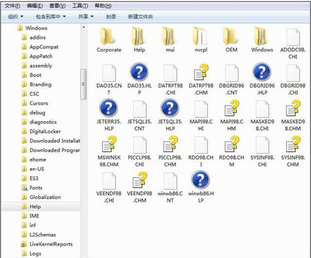

# 什么是文件系统？

文件系统就是管理文件的软件，每一个文件其实就是(二进制)数据，存储在磁盘上。`实质上文件系统就是管理磁盘的软件系统。`如下图，这软件就是一个文件系统。

**磁盘**

我们可以把硬盘看做是一个仓库，我们可以在仓库里面存放各种物品，我们可以手动操作硬盘，但是这样的坏处是当缺乏规划时，数据会被毫无规律的放在磁盘上，最后查找文件会很费劲，同时会产生严重的内存碎片。

# 文件系统

有了文件系统，我们就可以对文件进行统一管理，通过文件系统来对空间进行规划和编排。

上图就是一个案例，虽然可存放资源的空间变少了，但是存放更规整了。

**也就是说，文件系统解决了普通用户使用磁盘存储数据的问题。**

# 分布式文件系统

分布式文件系统就是网络文件系统，主要解决多台主机文件共享的问题。NTFS、Ext4只是单机文件系统，无法再多台主机间方便的共享资源。
特别是大数据领域、深度学习领域，需要进行计算的数据都是非常巨大，但是无法承载的，所以需要分布式文件系统来对资源进行统一管理。
比如HDFS，就是一个文件系统，他管理数据，同时会对数据进行冗余和备份。

# 参考资料

[为什么要有文件系统？文件系统都有哪些种类？](https://baijiahao.baidu.com/s?id=1634753610969441559&wfr=spider&for=pc)